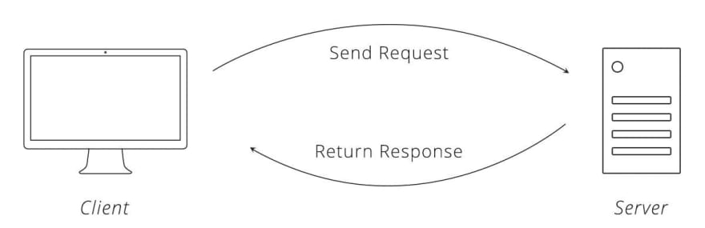

# Movies-Library - 1.0

**Author Name**: Qais Manasra

## WRRC

## Overview

## Getting Started
1.Draw the web request response cycle for the task at hand.
2.Setup a repository.
3.Clone the repository.
4.Initialize the project by running "npm init -y".
5.Install express by running "npm install express cors".
6.Build the Home Page Endpoint.
7.Build the Favorite Page Endpoint.
8.Create a function to handle the server error (status 500)
9.Create a function to handle "page not found error" (status 404)
10.Update Readme file.

## Project Features
<!-- What are the features included in you app -->